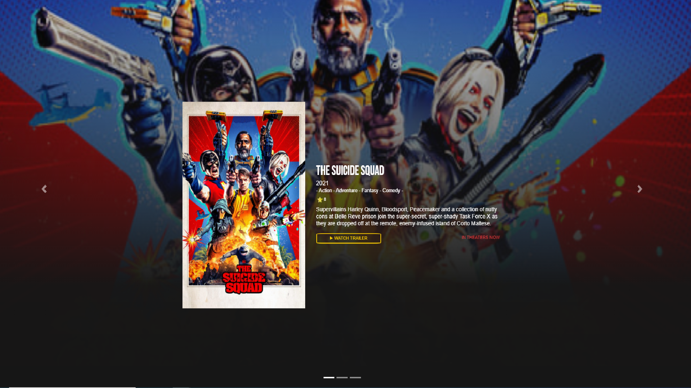
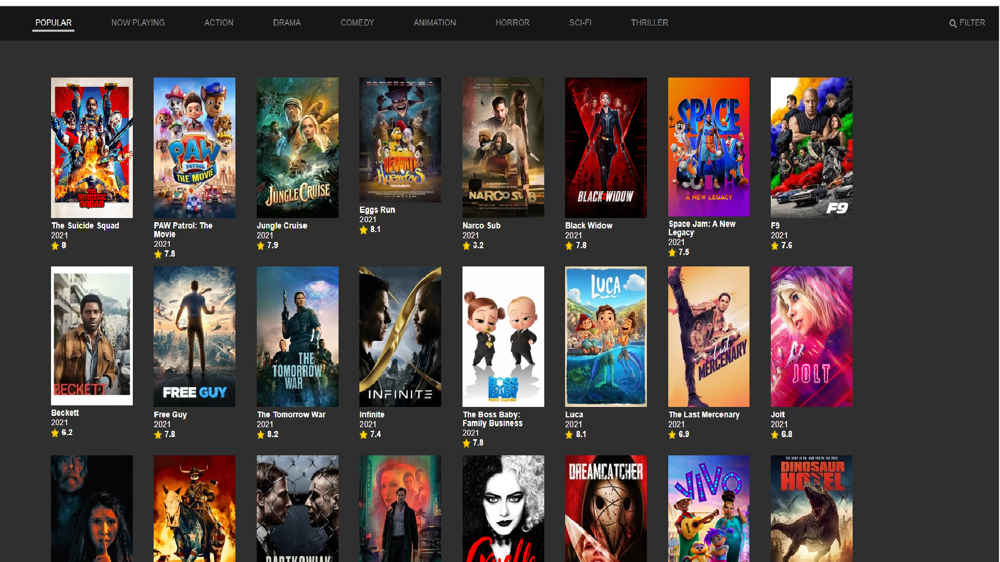
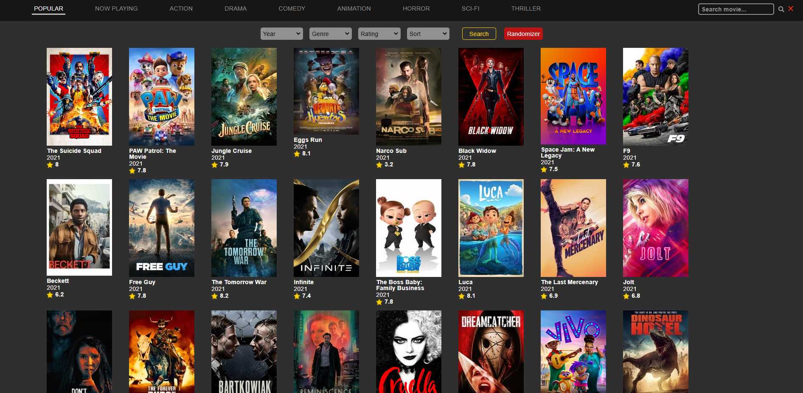
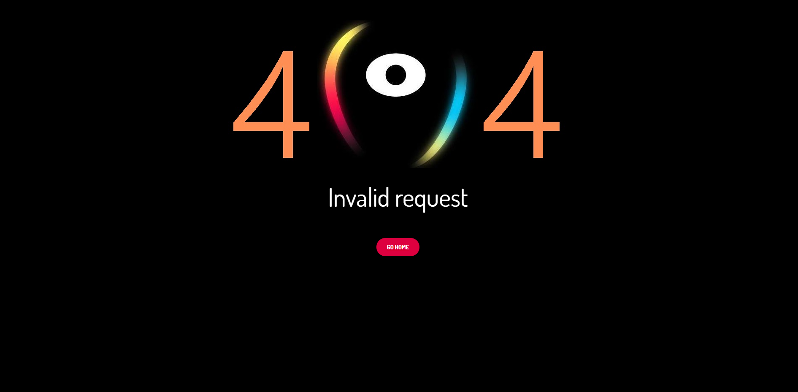

# Movies Data Base - MindSwap
This project was developed as part of the web development course for the front-end part at Mindera MindSwap.
> Live demo [_here_](https://github.com/toaraujo/project_2_mindswap).

## Table of Contents
* [General Info](#general-information)
* [Technologies Used](#technologies-used)
* [Features](#features)
* [Screenshots](#screenshots)
* [Setup](#setup)
* [Usage](#usage)
* [Project Status](#project-status)
* [Room for Improvement](#room-for-improvement)
* [Acknowledgements](#acknowledgements)
* [Contact](#contact)

## General Information
- The purpose of this project was to test the knowledge acquired in front-end classes.

## Technologies Used
- JavaScript
- Jquery - version 3.6.0.min
- Ajax
- CSS
- HTML
- BootStrap

## Features
List the ready features here:
- See information about movies
- Search some movies with filters chosen by the user
- Whatch the movies trailers 
- Modal with movies details
- Infinite scroll
- Responsive design

## Screenshots

<!-- If you have screenshots you'd like to share, include them here. -->

## Setup
To test this project the user only needs to have access to a browser.

How to install:
- Go to Git repository - https://github.com/toaraujo/project_2_mindswap
- Download to your PC
- Open index.html with your browser

## Usage
User can search by clicking genres tabs or magnifying glass to search by name or clicking filter tab for more parameterized search.
User can see the movie details by clicking on the corresponding poster.

Use cases and code examples:
- Search by name

    function searchByName(input, page) {
        let id = document.getElementById('searchInput_movies_container');
        id.innerHTML = '';
        let valueInput = input;
        let url = `https://api.themoviedb.org/3/search/movie?${APIKey}&query=${valueInput}`;
        requestAPI(url, id);
    }

- Search with filters

    function filter(page) {
        let id = document.getElementById('searchBtn_movies_container');
        const discoverEndpoint = 'discover/movie?';
        const genreEndpoint = document.getElementById('filter-nav__genre').value;
        const sortByEndpoint = document.getElementById('filter-nav__sort').value;
        const releaseDate = document.getElementById('filter-nav__movie-year').value;
        const releaseDateEndPoint = `&primary_release_date.gte=${releaseDate}-01-01&primary_release_date.lte=${releaseDate}-12-31`;
        const voteAvrEndpoint = document.getElementById('filter-nav__rating').value;
    
        if (page === 1) {
            movies = [];
        }
    
        let url = APIRequestPrefix + discoverEndpoint + APIKey + `&language=en-US${sortByEndpoint}&page='${page}` + releaseDateEndPoint + voteAvrEndpoint + genreEndpoint;
    
        requestAPI(url, id);
    
        resetFilter();
    }

## Project Status
Project is: _complete_ / but we can make some design improvements later.

## Room for Improvement
Room for improvement:
- Some design
- Website responsiveness

## Acknowledgements

- Many thanks to Mindera MindSwap teachers.

## Contact
Created by:
- Diana Moura -> diana.moura@mindswap.academy)
- António Araújo -> antonio.araujo@mindswap.academy
- Jorge Pereira -> jorge.pereira@mindswap.academy
